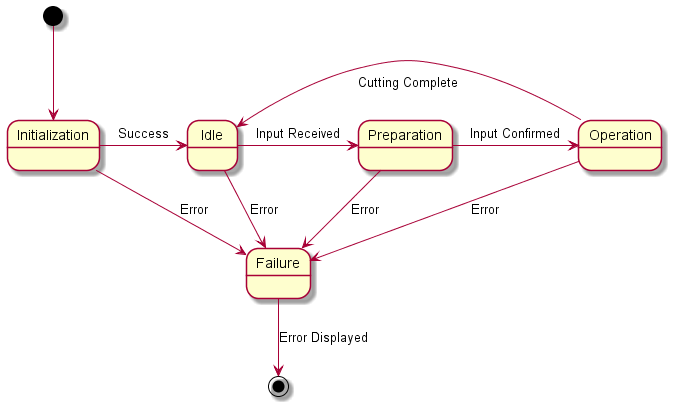

# Requirements
## Hardware
* The device shall be able to feed small-gauge wire to a cutting head.
* The device shall have a safety covering over the cutting head.
* The device shall be able to cut small-gauge wire.
* The device shall be able to cut small-gauge wire with an accuracy of ±1/16in
* The device shall have a single power on/off switch.
* The device shall display information and user prompts on a 16x2 LCD.
* The device shall accept user input from a 3x4 matrix keypad.
* The device shall drop cut wire into a receptacle.
* The device shall use a BBC micro:bit V2 as a system controller.
* The device shall enter a safe "fail state" if any errors are encountered.

## Software
* The software shall allow the user to select the desired size of cut wire.
* The software shall allow the user to select the number of wires to cut.
* The software shall be able to detect when a spool of wire has run out.

# Architecture
## State Machine
The micro:bit must maintain a set of states and transitions in order to provide a straightforward experience.

## Initialization
Upon receiving power, the peripheral devices attached to the micro:bit must be initialized (and optionally tested). This module will be responsible for performing these initialization sequences.

## Input Parsing
Inputs from peripheral devices must be received and parsed in order to determine the status of the system and perform to user specification.

## Motor Driver(s)
The motor(s) must be driven to user specification.

# Design
## Statechart


## Initialization
Upon power-up, the micro:bit will take the following sequence of actions:

1. Verify communications with LCD
2. Verify communications with keypad
3. Verify communications with motor(s) 
4. Enter Idle state

## Idle
A largely quiescent state where the micro:bit will sit idle until the user begins providing input via the keypad.

## Preparation
This is the input-collection state. A series of prompts will be presented to the user on the LCD to determine the parameters of the cuts that should be made. The user will respond to the prompt and press "`#`" to confirm the response; "`*`" can be used as a backspace button. The prompts will be:

1. Cut length
```
0123456789012345
CUT LENGTH (in):
-> _
```
2. Number of cuts
```
0123456789012345
NUMBER OF CUTS:
-> _
```
3. Final confirmation
```
0123456789012345
##in x ####
OK? _
```
